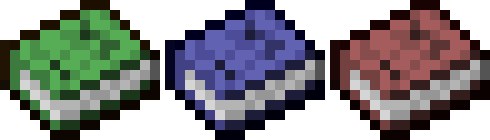

<!-- PROJECT LOGO -->
 

  

  <h3 align="center">Blueprints</h3>

  

    Enhance your gameplay by adding the requirement to unlock item recipe before crafting it.
     
    <a href="https://github.com/Vinderguy/Blueprints/wiki"><strong>Explore the docs »</strong></a>
     
     
    <a href="https://github.com/Vinderguy/Blueprints/issues">Report Bug</a>
    ·
    <a href="https://github.com/Vinderguy/Blueprints/issues">Request Feature</a>
  

<!-- TABLE OF CONTENTS -->
## Table of Contents

* [About the Project](#about-the-project)
* [Getting Started](#getting-started)
* [How To Play](#how-to-play)
* [Contributing](#contributing)
* [License](#license)
* [Contact](#contact)
* [Acknowledgements](#acknowledgements)

<!-- ABOUT THE PROJECT -->
## About The Project

Blueprints mod uses knowledge books added in 1.12 to make Minecraft more exciting and challenging. How does it work? You can't craft item if you don't have unlocked recipe for it. How do I unlock recipes? You can find different tiers of blueprints (knowledge books) in different locations. It forces you to explore the map instead of spending hours mining in caves. When connected with Minecraft's hardcore mode it gets more interesting. Using it on a multiplayer fractions server make the gameplay 
unforgettable experience.

<!-- GETTING STARTED -->
## Getting Started

Follow these steps to get Blueprints in your Minecraft world:

1. [Download](https://github.com/Vinderguy/Blueprints/releases/tag/v0.2) the latest Blueprints relase for the Minecraft version you use.
2. Extract downloaded archive.
3. Copy `blueprints` folder from `datapacks` to your Minecraft world save datapacks directory:\
`
%appdata%\.minecraft\saves\[YOUR WORLD NAME]\datapacks
`
4. Copy `blueprints` folder from `resourcepacks` to your Minecraft resourcepacks directory:\
`
%appdata%\.minecraft\resourcepacks
`
5. Turn on Blueprints resourcepack in game settings.
6. If you're ingame, open chat and type:
`/reload`
7. Enable Blueprints:
`/gamerule doLimitedCrafting true`
8. If you're adding blueprints to a world you've already played, clear your recipes by typing:
`/recipe take @s *`
9. Unlock default recipes:
`/function blueprints:unlock_default_blueprints`
10. GL&HF!

<!-- HOW TO PLAY -->
## How To Play

1. You can't craft items that you've not unlocked first.

2. **Tier 1** (green) blueprints can be found inside villages, abounded mineshafts, small dungeons, shipwrecks & underwater ruins. **Tier 2** (blue) blueprints can be found inside temples, igloos, pillager outposts, woodland mansions, nether fortresses, buried treasures & strongholds. **Tier 3** (red) blueprints can be found only in the end.

3. Right-click blueprints to unlock them.

4. If you have unlocked an item, you can craft it.

_For more examples, please refer to the [Documentation](https://github.com/Vinderguy/Blueprints/wiki)_

<!-- CONTRIBUTING -->
## Contributing

Contributions are what make the open source community such an amazing place to be learn, inspire, and create. Any contributions you make are **greatly appreciated**.

1. Fork the Project
2. Create your Feature Branch (`git checkout -b feature/AmazingFeature`)
3. Commit your Changes (`git commit -m 'Add some AmazingFeature`)
4. Push to the Branch (`git push origin feature/AmazingFeature`)
5. Open a Pull Request

<!-- LICENSE -->
## License

Distributed under the MIT License. See `LICENSE` for more information.

<!-- CONTACT -->
## Contact

Vinderguy - Vinderguy#2666 - vinderguy@gmail.com

Project Link: [https://github.com/Vinderguy/Blueprints](https://github.com/Vinderguy/Blueprints)

<!-- ACKNOWLEDGEMENTS -->
## Acknowledgements

* [Best-README-Template](https://github.com/othneildrew/Best-README-Template)
